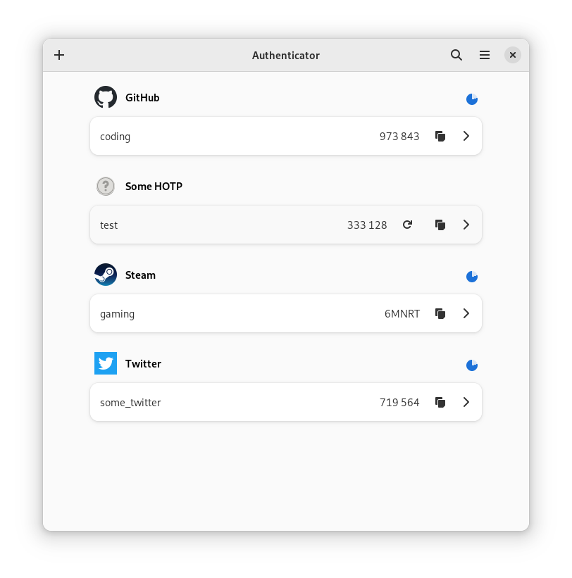
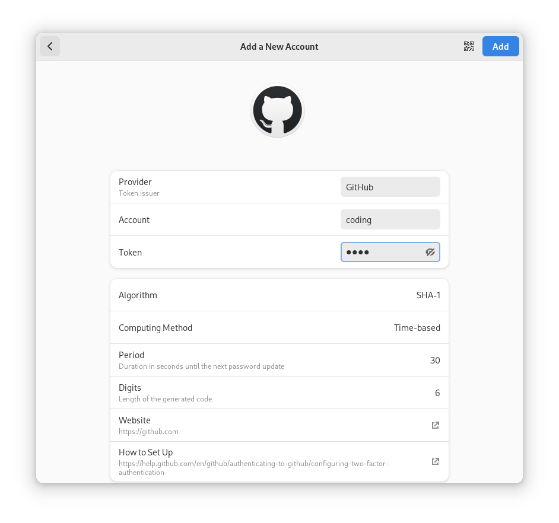

# Authenticator

Generate Two-Factor codes

## Screenshots

## Features

- Time-based/Counter-based methods support
- SHA1/SHA256/SHA512 algorithms support
- QR code scanner
- Lock the application with a password
- Beautiful UI
- Backup/Restore from/into known applications like FreeOTP+, andOTP, Bitwarden

## Getting in touch

If you have any questions regarding the use or development of Authenticator, please join us on our [#authenticator:gnome.org](https://matrix.to/#/#authenticator:gnome.org) channel.

## Hack on Authenticator

To build the development version of Authenticator and hack on the code
see the [general guide](https://wiki.gnome.org/Newcomers/BuildProject)
for building GNOME apps with Flatpak and GNOME Builder.

## Credits

- We ship a database of providers based on [twofactorauth](https://github.com/2factorauth/twofactorauth), by the 2factorauth team
